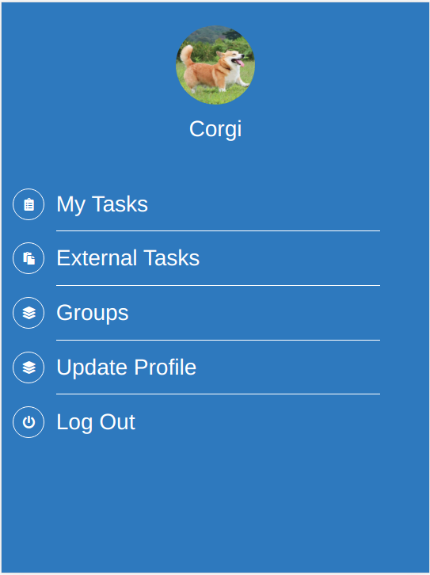

# Ruby on Rails Capstone: Tasker!

> Tasker is an alternative take on the 'Group our transactions' project. Instead of targeting economic transactions, it is aimed at informal task management, such as roommates in an appartment. 

Users can create Groups. In the groups, tasks can be added, which will indicate how much participation any given user has in the group. One task can be repeated in many groups as well (for example, a person who cooks in two appartments). 

## Features

- User creation, no password needed.
- User can change his avatar picture.
- User can create groups. Each group has a name and a picture associated.
- User can add existing tasks to a group. The tasks can be owned by any other user.
- Each group displays the 3 greatest contributors.
- User can create a Task. The task can inmediatly be added to a group, or it can be left by itself.
- 2 Task listing menus. One for owned tasks associated to groups, and another for non-associated tasks.

## Built With

- Ruby
- Ruby on Rails
- SASS
- HTML 5
- DB: Postgre
- remote storage on AWS S3
- Tested with Rspec, Capybara, Bullet.

## Live Demo

[Live Demo Link](https://desolate-retreat-49950.herokuapp.com/)

## Getting Started

The project can be cloned from [this repository]()

### Prerequisites

- Ruby, version 2.7.0 onwards

### Usage

locally, go to the clone directory and run 'rails s'

### Run tests

Tests can be run using 'bundle exec rspec'

## Authors

👤 **Rodrigo Ibaceta**

- GitHub: [Rodrigo Ibateca](https://github.com/RokoVarano/)
- Twitter: [@Rodrigo](https://twitter.com/RodrigoIbacet11)
- LinkedIn: [LinkedIn](https://www.linkedin.com/in/rodrigo-ibaceta-a8657611a/)

## 🤝 Contributing

Contributions, issues, and feature requests are welcome!

Feel free to check the [issues page](../../issues/).

## Show your support

Give a ⭐️ if you like this project!

## Acknowledgments

- Hat tip to anyone whose code was used
- Inspiration
- etc

## 📝 License

This project is [MIT](LICENSE) licensed.